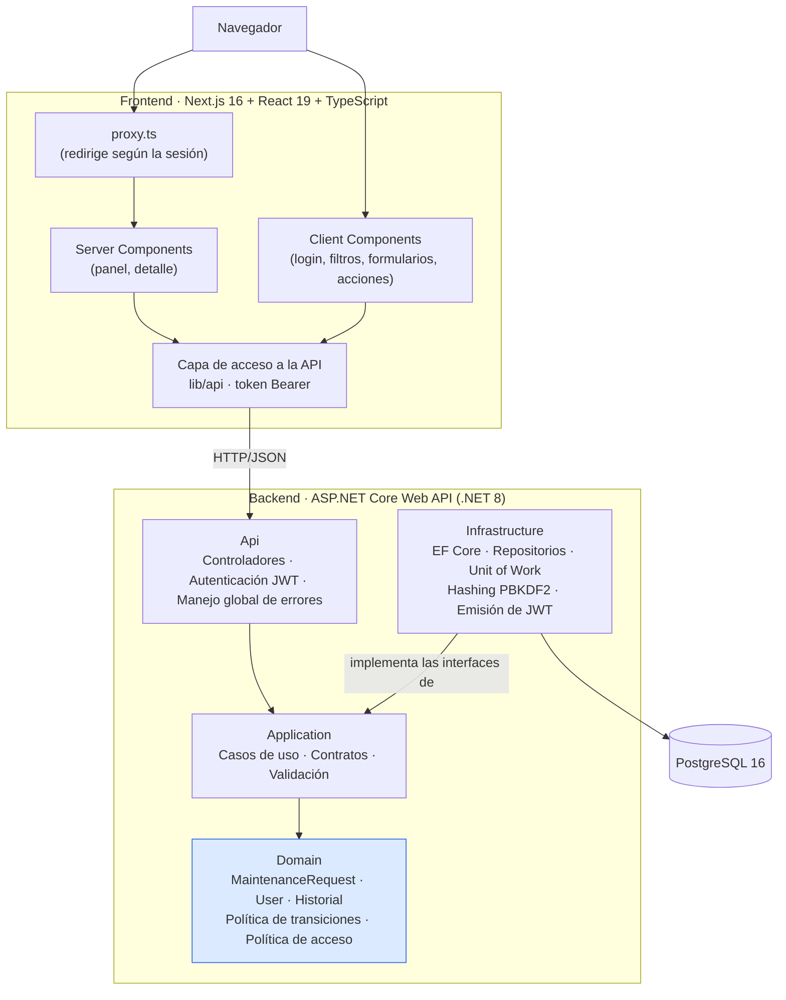

# Gestión de solicitudes de mantenimiento

Aplicación web para registrar solicitudes de mantenimiento, asignar responsables, gestionar su
ciclo de vida y consultar su historial de actividad, con **tres perfiles de usuario**: el
cliente que se registra, reporta y hace seguimiento; el personal de la empresa que atiende; y el
administrador que gestiona cuentas y roles.

Prueba técnica para **Expertos Seguridad LTDA** — Desarrollador Full Stack Mid-Level.

| | |
|---|---|
| **Backend** | .NET 8 · ASP.NET Core Web API · Entity Framework Core |
| **Frontend** | Next.js 16 (App Router) · React 19 · TypeScript · Tailwind CSS |
| **Base de datos** | PostgreSQL 16 |
| **Pruebas** | xUnit · FluentAssertions · Testcontainers |
| **Ejecución** | Docker Compose |

---

## 1. Requisitos

Para ejecutar con Docker (recomendado) solo se necesita:

- **Docker Desktop** 4.x o superior, con Docker Compose v2.

Para ejecutar o desarrollar sin contenedores:

- **.NET SDK 8.0**
- **Node.js 20** o superior
- **PostgreSQL 16** accesible localmente

---

## 2. Ejecución con Docker Compose

```bash
# 1. Clonar el repositorio
git clone <url-del-repositorio>
cd ExpertosSeguridad

# 2. Crear el archivo de variables de entorno a partir del ejemplo
cp .env.example .env        # En Windows PowerShell: Copy-Item .env.example .env

# 3. Levantar base de datos, API y frontend
docker compose up --build
```

Al finalizar quedan disponibles:

| Servicio | URL |
|---|---|
| Aplicación web | <http://localhost:3000> |
| API | <http://localhost:8080> |
| Documentación Swagger | <http://localhost:8080/swagger> |
| Verificación de estado | <http://localhost:8080/health> |

La API aplica las migraciones automáticamente al iniciar. **No inserta datos de ejemplo ni
cuentas**: la aplicación arranca vacía.

### Primer acceso: crear el administrador

Como no hay cuentas precargadas, el primer administrador se crea en dos pasos, una sola vez:

1. Registre una cuenta en <http://localhost:3000/register>. Toda cuenta registrada nace como
   **Solicitante**.
2. Promuévala a administrador directamente en la base de datos (reemplace el correo):

   ```bash
   docker compose exec database sh -c 'psql -U "$POSTGRES_USER" -d "$POSTGRES_DB" \
     -c "UPDATE users SET \"Role\" = '"'"'Admin'"'"' WHERE \"Email\" = '"'"'su.correo@ejemplo.com'"'"';"'
   ```

   Cierre sesión y vuelva a entrar: la sesión anterior se invalida sola al detectar el cambio de rol.

Desde ahí todo se hace en la aplicación. El administrador entra a **Usuarios y roles** y promueve
a **Personal** a quienes atienden solicitudes. Los clientes se registran solos en `/register` y
quedan como **Solicitante**; solo un administrador puede cambiarles el rol.

> Este paso por la base de datos existe solo para el primer administrador, porque nadie más puede
> otorgar ese rol. Está documentado como limitación en `docs/decisiones-tecnicas.md`.

Para detener y eliminar también los datos persistidos:

```bash
docker compose down -v
```

### Variables de entorno

Todas están documentadas en [`.env.example`](.env.example). El archivo `.env` está incluido en
`.gitignore`: **el repositorio no contiene contraseñas, tokens ni secretos**, y los valores del
ejemplo son exclusivamente para desarrollo local.

---

## 3. Ejecución sin Docker

### Base de datos

```bash
docker run --name maintenance-db -e POSTGRES_PASSWORD=postgres \
  -e POSTGRES_DB=maintenance -p 5432:5432 -d postgres:16-alpine
```

### Backend

```bash
cd backend

# La cadena de conexión se toma exclusivamente de la configuración/entorno
export ConnectionStrings__Default="Host=localhost;Port=5432;Database=maintenance;Username=postgres;Password=postgres"
export ASPNETCORE_ENVIRONMENT=Development   # aplica las migraciones al iniciar

dotnet run --project src/ExpertosSeguridad.Api
```

En PowerShell las dos primeras líneas se escriben así:

```powershell
$env:ConnectionStrings__Default = "Host=localhost;Port=5432;Database=maintenance;Username=postgres;Password=postgres"
$env:ASPNETCORE_ENVIRONMENT = "Development"
```

En `Development`, `appsettings.Development.json` ya trae una clave de firma local, así que no
hace falta configurar nada más. Fuera de ese entorno la API
**se niega a arrancar** sin `Jwt__SigningKey` (mínimo 32 caracteres).

La API queda en <http://localhost:5xxx> (el puerto lo indica la consola). Si se usa un puerto
distinto de 8080, ajuste `NEXT_PUBLIC_API_URL` para el frontend.

### Frontend

```bash
cd frontend
npm install
echo "NEXT_PUBLIC_API_URL=http://localhost:8080" > .env.local
npm run dev
```

### Migraciones

Las migraciones están versionadas en
`backend/src/ExpertosSeguridad.Infrastructure/Persistence/Migrations`. Se aplican solas al
iniciar la API, o manualmente:

```bash
cd backend
dotnet tool install --global dotnet-ef        # solo la primera vez
dotnet ef database update \
  -p src/ExpertosSeguridad.Infrastructure \
  -s src/ExpertosSeguridad.Infrastructure
```

---

## 4. Pruebas

```bash
cd backend

# Reglas de dominio: no requieren base de datos ni levantar la aplicación web
dotnet test tests/ExpertosSeguridad.Domain.Tests

# Integración de la API sobre PostgreSQL real (requiere Docker en ejecución)
dotnet test tests/ExpertosSeguridad.IntegrationTests

# Todo
dotnet test
```

### Qué se cubre

**Pruebas unitarias de dominio** (`ExpertosSeguridad.Domain.Tests`) — sin infraestructura:

- Creación válida: estado inicial `Pending`, fecha del servidor y registro en el historial.
- Rechazo de datos inválidos: título y descripción fuera de rango, enumeraciones no definidas.
- Todas las transiciones permitidas de la tabla del enunciado.
- Todas las transiciones no permitidas, incluidos los estados terminales, verificando que el
  estado y el historial quedan intactos.
- Asignación, reasignación y desasignación de responsable, con el valor anterior, el nuevo y
  el actor registrados en el historial.
- Reglas de la entidad `User`: normalización del correo, formatos inválidos, rol no definido.
- Política de acceso por rol (`RequestAccessPolicy`, `UserAdministrationPolicy`): quién crea,
  quién gestiona el ciclo de vida, quién administra usuarios y qué ve cada perfil — sin HTTP ni
  base de datos.
- Administración de cuentas en la entidad `User`: el registro siempre produce un Solicitante,
  nadie puede cambiar su propio rol ni desactivarse, y una cuenta desactivada no inicia sesión.

**Pruebas de integración** (`ExpertosSeguridad.IntegrationTests`) — pipeline real de la API
contra un contenedor de PostgreSQL levantado por Testcontainers, con las migraciones del
repositorio aplicadas:

- Flujo completo por HTTP: el solicitante crea → el personal asigna responsable → cambia estado
  → se relee el detalle y se comprueba el historial persistido, con el actor autenticado.
- Transición no permitida rechazada con `409` sin dejar rastro en la base de datos.
- Carga inválida rechazada con `400` y errores por campo.
- Listado con filtros, búsqueda, orden y paginación resueltos en el servidor.
- Panel de resumen calculado a partir de los datos persistidos.

Y las reglas que hacen reales los perfiles (`AuthorizationApiTests`):

- Los endpoints protegidos rechazan a un llamante anónimo con `401`.
- Un correo desconocido y una contraseña incorrecta producen **respuestas idénticas**, de modo
  que el login no permite descubrir qué cuentas existen.
- Un solicitante solo ve sus propias solicitudes en el listado y en los indicadores; el personal
  ve todas.
- Un solicitante que pide una solicitud ajena recibe `404`, no `403`.
- Un solicitante no puede cambiar el estado ni asignar responsable (`403`), y la solicitud queda
  intacta.
- El personal no puede registrar solicitudes (`403`).
- Asignar como responsable a alguien que no es personal se rechaza con `400`.

Registro (`RegistrationApiTests`) y administración (`UserAdministrationApiTests`):

- El registro crea un Solicitante que puede abrir solicitudes de inmediato.
- Un `"role": "Admin"` colado en el cuerpo del registro se ignora.
- Un correo ya registrado —con otras mayúsculas— da `409` en el campo `email`.
- Contraseñas débiles se rechazan con `400` en el campo `password`.
- Un JSON malformado responde un mensaje genérico **sin exponer nombres de tipos internos**.
- Solo el administrador accede a `/api/admin/users`.
- Promover a alguien **invalida su token anterior** en la siguiente llamada; el nuevo token
  trae el rol nuevo y sus permisos.
- Desactivar una cuenta corta su sesión abierta y le impide iniciar sesión hasta reactivarla;
  además deja de aparecer como responsable asignable.
- El administrador no puede cambiar su propio rol ni desactivarse.
- El administrador ve todas las solicitudes pero no puede cambiarlas ni crearlas.

Flujo del responsable (`ResponsibleWorkflowApiTests`):

- Una solicitud pendiente no se puede iniciar a mano (`409`); asignarla la inicia.
- Solo el responsable puede ponerla en espera, reanudarla y resolverla; otro miembro del personal
  recibe `403` y la API tampoco le ofrece esas acciones.
- Cualquier miembro del personal puede cancelar una solicitud asignada a otra persona.
- Al reasignar, la ejecución pasa al nuevo responsable y el anterior la pierde.
- Una solicitud iniciada no puede quedar sin responsable (`400`).
- Resolver por el endpoint de estado se rechaza (`400`); por `/resolution` exige título y
  descripción válidos, y el solicitante lee la respuesta con el nombre de quien la dio.
- El listado del personal pone primero todas sus solicitudes asignadas (en curso antes que
  cerradas), incluso entre páginas y con filtros; las de otras personas siguen el orden por fecha.

> Las pruebas de integración necesitan Docker en ejecución: Testcontainers crea y destruye un
> PostgreSQL efímero, de modo que no dependen de ninguna base de datos preexistente.

---

## 5. API

Base: `http://localhost:8080`. Documentación interactiva en `/swagger`.

| Método | Ruta | Perfil | Descripción |
|---|---|---|---|
| `POST` | `/api/auth/login` | Anónimo | Devuelve el token de acceso y el usuario |
| `POST` | `/api/auth/register` | Anónimo | Crea una cuenta de cliente (siempre Solicitante) y devuelve su token |
| `GET` | `/api/auth/me` | Autenticado | Usuario de la sesión actual |
| `POST` | `/api/maintenance-requests` | Solicitante | Registra una solicitud (siempre en estado `Pending`) |
| `GET` | `/api/maintenance-requests` | Autenticado | Listado paginado con filtros, búsqueda y orden. El personal ve todas; un solicitante, solo las suyas |
| `GET` | `/api/maintenance-requests/summary` | Autenticado | Indicadores del panel, con el mismo alcance que el listado |
| `GET` | `/api/maintenance-requests/{id}` | Autenticado | Detalle con responsable e historial |
| `PATCH` | `/api/maintenance-requests/{id}/status` | Personal | Cambia el estado validando la transición. No acepta `Resolved` |
| `POST` | `/api/maintenance-requests/{id}/resolution` | Responsable | Resuelve la solicitud con una respuesta (`title`, `description`) para el solicitante |
| `PATCH` | `/api/maintenance-requests/{id}/responsible` | Personal | Asigna, cambia o retira el responsable |
| `GET` | `/api/users/staff` | Personal | Catálogo del personal activo, para el selector de responsable |
| `GET` | `/api/admin/users` | Administrador | Cuentas paginadas; filtros `role`, `isActive`, `search` (nombre o correo) |
| `PATCH` | `/api/admin/users/{id}/role` | Administrador | Cambia el rol. No sobre la propia cuenta |
| `PATCH` | `/api/admin/users/{id}/status` | Administrador | Activa o desactiva la cuenta. No sobre la propia cuenta |

**Parámetros del listado:** `page`, `pageSize` (máx. 100), `status`, `priority`, `category`,
`search` (por título), `sortByCreatedAt` (`Asc` | `Desc`).

### Autenticación

Todos los endpoints salvo `/api/auth/login` y `/api/auth/register` requieren el encabezado
`Authorization: Bearer <token>`. El token se obtiene así:

```bash
curl -X POST http://localhost:8080/api/auth/login \
  -H 'Content-Type: application/json' \
  -d '{"email":"su.correo@ejemplo.com","password":"su-contraseña"}'
```

En Swagger, el botón **Authorize** acepta ese mismo `accessToken`.

El usuario autenticado es también el que queda registrado en el historial como autor de cada
cambio, y el que se registra como solicitante al crear: **ninguno de los dos se puede enviar en
el cuerpo de la petición**.

**Los cambios de permisos son inmediatos.** Cada request vuelve a comprobar en la base de datos
que la cuenta siga activa y con el mismo rol que dice el token. Si un administrador la desactiva
o le cambia el rol, el token anterior se rechaza con `401` en la siguiente llamada, aunque no haya
expirado, y la interfaz lleva a la persona a iniciar sesión otra vez.

**Errores:** todas las respuestas de error siguen el formato `ProblemDetails` de RFC 7807.

| Código | Cuándo |
|---|---|
| `400` | Datos inválidos — incluye `errors` con el detalle por campo |
| `401` | Falta el token, está vencido, la cuenta cambió desde que se emitió, o las credenciales del login no son correctas |
| `403` | El rol del usuario no permite la operación, o la cuenta está desactivada (al iniciar sesión) |
| `404` | La solicitud no existe **o no pertenece al solicitante que la pide** |
| `409` | La transición de estado no está contemplada, o el correo ya está registrado |
| `500` | Error inesperado — mensaje genérico, sin detalles internos |

### Ciclo de vida

| Estado actual | Transiciones permitidas |
|---|---|
| `Pending` | `InProgress`, `Cancelled` |
| `InProgress` | `OnHold`, `Resolved`, `Cancelled` |
| `OnHold` | `InProgress`, `Cancelled` |
| `Resolved` | — |
| `Cancelled` | — |

La regla vive en un único lugar (`RequestStatusTransitionPolicy`, en el dominio). El backend la
valida siempre; el detalle de cada solicitud expone `allowedNextStatuses` para que la interfaz
solo muestre las acciones posibles sin volver a declarar la regla.

### Flujo de atención

Sobre esa tabla, el proceso se organiza alrededor del **responsable**:

1. **Asignar inicia la solicitud.** Al asignar un responsable a una solicitud `Pending`, pasa sola
   a `InProgress`. No hay un botón «iniciar» aparte: una solicitud en progreso siempre tiene a
   alguien a cargo. En el historial quedan dos entradas —la asignación y el cambio de estado que
   provocó—, guardadas en la misma transacción.
2. **El responsable ejecuta.** Solo él puede ponerla en espera, reanudarla y **resolverla**.
3. **El personal coordina.** Cualquier miembro del personal puede asignar, reasignar y cancelar,
   de modo que una solicitud nunca queda bloqueada si su responsable no está disponible.
4. **Se puede reasignar, no dejar sin responsable.** Quitarlo exigiría volver a `Pending`, una
   transición que la tabla del enunciado no contempla.
5. **Cada uno ve primero lo suyo.** En el listado del personal aparecen primero **todas** las
   solicitudes asignadas a esa persona —las que siguen en curso antes que las ya cerradas— y
   después el resto por fecha. El orden lo resuelve el backend en la misma consulta paginada, así
   que se mantiene entre páginas y respeta los filtros.
6. **Resolver exige una respuesta.** El botón «Resolver solicitud» abre un formulario con título,
   descripción y quién responde. La respuesta y el cambio a `Resolved` se guardan juntos, y el
   solicitante la lee en el detalle. El endpoint de estado no acepta `Resolved`: no hay forma de
   cerrar una solicitud sin contestarle a quien la pidió.

**Identificador legible.** Cada solicitud tiene un número secuencial (`SOL-0007`) asignado por la
base de datos. Es el identificador que muestra el listado (RF-02); el `Guid` sigue siendo la clave
interna y la de las URLs, pero ya no se le muestra a nadie.

**Indicadores del panel** (RF-06): los ven el personal y el administrador, que son quienes operan o
supervisan el conjunto. El solicitante sigue sus solicitudes directamente en su listado.

El detalle incluye `availableActions`, **las acciones que el usuario que consulta puede hacer en
ese momento**, calculadas con las mismas políticas que después validan cada operación. La
interfaz dibuja sus botones a partir de ahí: el responsable ve «Resolver solicitud», otro miembro
del personal ve «Reasignar» y «Cancelar», y un solicitante no ve ninguna.

### Perfiles y permisos

| | Solicitante | Personal | Administrador |
|---|---|---|---|
| Registrar una solicitud | ✅ | ❌ | ❌ |
| Ver solicitudes e historial | Solo las propias | Todas | Todas (solo lectura) |
| Asignar o reasignar responsable (inicia la solicitud) | ❌ | ✅ cualquiera | ❌ |
| Poner en espera, reanudar, **resolver** | ❌ | ✅ solo el responsable | ❌ |
| Cancelar | ❌ | ✅ cualquiera | ❌ |
| Consultar el catálogo de personal | ❌ | ✅ | ❌ |
| Gestionar cuentas y roles | ❌ | ❌ | ✅ (excepto la propia) |

**El administrador supervisa pero no opera** (separación de funciones): quien otorga permisos no
es quien los usa, así que ninguna cuenta puede darse un permiso y ejercerlo. Y **no puede cambiar
su propio rol ni desactivarse**, lo que garantiza que la plataforma nunca quede sin
administrador: el último no puede quitarse a sí mismo y nadie más puede quitárselo.

Las reglas viven en el dominio: `RequestAccessPolicy` y `UserAdministrationPolicy` para los roles,
y la entidad `User` para las restricciones sobre la propia cuenta. El
`[Authorize]` de los controladores solo bloquea el tráfico anónimo: la pertenencia de los datos
(«esta solicitud es mía») depende de los datos y por eso se verifica en los casos de uso. La
interfaz oculta lo que no corresponde, pero no es quien lo hace cumplir.

---

## 6. Arquitectura



Las dependencias apuntan hacia adentro: `Domain` no conoce a nadie, `Application` solo conoce
`Domain`, e `Infrastructure` implementa las interfaces declaradas en `Application`. El dominio
no tiene referencias a EF Core ni a ASP.NET Core.

### Flujo de una solicitud

1. El usuario inicia sesión; la API devuelve un JWT firmado que el navegador guarda en una cookie
   legible también desde el servidor de Next.
2. El componente llama a `lib/api`, que agrega `Authorization: Bearer <token>`.
3. ASP.NET Core valida el token y construye el principal. `ClaimsCurrentUserProvider` lo traduce
   al `CurrentUser` que entienden los casos de uso — es la única clase que sabe que existe un JWT.
4. El controlador recibe el DTO y delega en el caso de uso. No contiene reglas ni acceso a datos.
5. El caso de uso valida el contrato, **consulta `RequestAccessPolicy`** para saber si ese actor
   puede hacer esa operación, y **delega la regla del ciclo de vida al agregado**.
6. `MaintenanceRequest` valida la transición y **agrega la entrada del historial en la misma
   operación**, con el actor autenticado: no existe forma de cambiar el estado sin registrarlo,
   ni de registrar a nombre de otro.
7. `UnitOfWork` confirma ambos cambios con un único `SaveChanges`, es decir, una sola transacción.
8. Si algo falla, el manejador global traduce la excepción al código HTTP correspondiente.

### Estructura del repositorio

```
├── backend/
│   ├── src/
│   │   ├── ExpertosSeguridad.Domain/          Entidades, invariantes, políticas de transición y de acceso
│   │   ├── ExpertosSeguridad.Application/     Casos de uso, contratos, validación, interfaces
│   │   ├── ExpertosSeguridad.Infrastructure/  EF Core, repositorios, migraciones, hashing, emisión de JWT
│   │   └── ExpertosSeguridad.Api/             Controladores, autenticación, errores, composición
│   ├── tests/
│   │   ├── ExpertosSeguridad.Domain.Tests/    Reglas de negocio y de acceso sin infraestructura
│   │   └── ExpertosSeguridad.IntegrationTests/ API + PostgreSQL real (Testcontainers)
│   └── Dockerfile
├── frontend/
│   ├── src/app/login/, src/app/register/      Inicio de sesión y registro de clientes (públicos)
│   ├── src/app/logout/                        Route handler que borra la cookie de sesión
│   ├── src/app/(authenticated)/               Área autenticada: panel, detalle, nueva solicitud
│   ├── src/app/(authenticated)/admin/users/   Panel de usuarios y roles
│   ├── src/components/                        Componentes reutilizables (auth, requests, ui)
│   ├── src/lib/                               Capa de API, sesión y utilidades de presentación
│   ├── src/proxy.ts                           Redirección entre login y área autenticada
│   └── Dockerfile
├── docs/decisiones-tecnicas.md                Justificación de las decisiones de diseño
├── docker-compose.yml
└── .env.example
```

---

## 7. Decisiones técnicas

La justificación detallada —estructura elegida, aplicación de SOLID y DDD, patrones
utilizados, decisiones de persistencia, limitaciones conocidas y mejoras propuestas— está en
**[docs/decisiones-tecnicas.md](docs/decisiones-tecnicas.md)**.

---

## 8. Simplificaciones

Explícitas y acotadas al alcance de la prueba:

- **El inicio de sesión y los roles son una extensión deliberada.** El enunciado indica que no es
  necesaria una autenticación real y permite un actor de prueba. Se implementó de todos modos
  porque la alternativa —un encabezado con el identificador del actor— permitía a cualquiera
  registrar cambios a nombre de otro, y eso volvía poco creíble el historial de auditoría que la
  prueba pide poder explicar.
- **El token vive en una cookie accesible desde JavaScript.** No es `httpOnly` porque el código
  cliente lo necesita; la mejora propuesta es moverlo detrás de route handlers de Next. Está
  razonado en [decisiones técnicas](docs/decisiones-tecnicas.md).
- **El registro no verifica el correo** (no hay integración de correo, según el enunciado), y no
  hay cambio ni recuperación de contraseña.
- **El administrador no crea cuentas directamente**: los clientes se registran solos y el
  personal se obtiene promoviendo una cuenta existente.
- **No hay límite de intentos en el login.**
- **No hay despliegue en la nube, correo, servicios externos ni carga de archivos**, según el
  enunciado.
