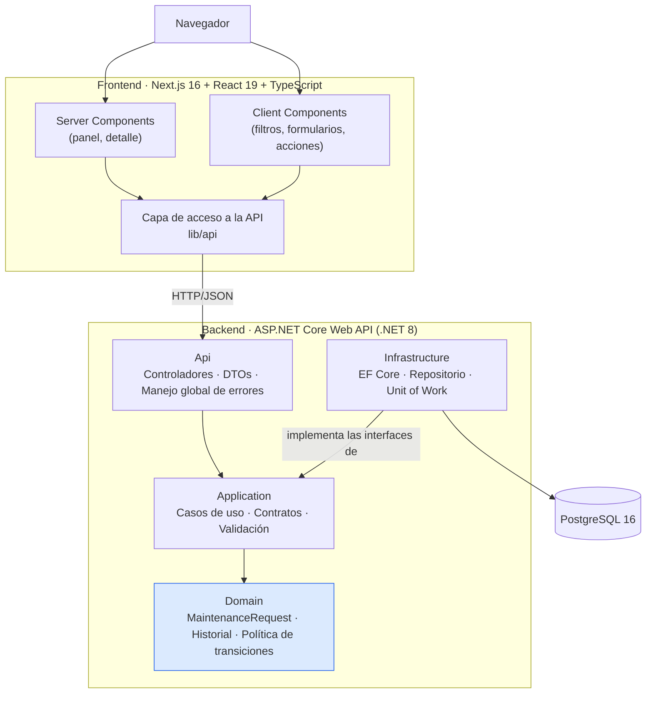

# Gestión de solicitudes de mantenimiento

Aplicación web para registrar solicitudes de mantenimiento, asignar responsables, gestionar su
ciclo de vida y consultar su historial de actividad.

Prueba técnica para **Expertos Seguridad LTDA** — Desarrollador Full Stack Mid-Level.

| | |
|---|---|
| **Backend** | .NET 8 · ASP.NET Core Web API · Entity Framework Core |
| **Frontend** | Next.js 16 (App Router) · React 19 · TypeScript · Tailwind CSS |
| **Base de datos** | PostgreSQL 16 |
| **Pruebas** | xUnit · FluentAssertions · Testcontainers |
| **Ejecución** | Docker Compose |

---

## 1. Requisitos

Para ejecutar con Docker (recomendado) solo se necesita:

- **Docker Desktop** 4.x o superior, con Docker Compose v2.

Para ejecutar o desarrollar sin contenedores:

- **.NET SDK 8.0**
- **Node.js 20** o superior
- **PostgreSQL 16** accesible localmente

---

## 2. Ejecución con Docker Compose

```bash
# 1. Clonar el repositorio
git clone <url-del-repositorio>
cd ExpertosSeguridad

# 2. Crear el archivo de variables de entorno a partir del ejemplo
cp .env.example .env        # En Windows PowerShell: Copy-Item .env.example .env

# 3. Levantar base de datos, API y frontend
docker compose up --build
```

Al finalizar quedan disponibles:

| Servicio | URL |
|---|---|
| Aplicación web | <http://localhost:3000> |
| API | <http://localhost:8080> |
| Documentación Swagger | <http://localhost:8080/swagger> |
| Verificación de estado | <http://localhost:8080/health> |

La API aplica las migraciones automáticamente al iniciar e inserta un conjunto pequeño de
datos de ejemplo la primera vez que la base de datos está vacía (se puede desactivar con
`SEED_SAMPLE_DATA=false` en el `.env`).

Para detener y eliminar también los datos persistidos:

```bash
docker compose down -v
```

### Variables de entorno

Todas están documentadas en [`.env.example`](.env.example). El archivo `.env` está incluido en
`.gitignore`: **el repositorio no contiene contraseñas, tokens ni secretos**, y los valores del
ejemplo son exclusivamente para desarrollo local.

---

## 3. Ejecución sin Docker

### Base de datos

```bash
docker run --name maintenance-db -e POSTGRES_PASSWORD=postgres \
  -e POSTGRES_DB=maintenance -p 5432:5432 -d postgres:16-alpine
```

### Backend

```bash
cd backend

# La cadena de conexión se toma exclusivamente de la configuración/entorno
export ConnectionStrings__Default="Host=localhost;Port=5432;Database=maintenance;Username=postgres;Password=postgres"
export ASPNETCORE_ENVIRONMENT=Development   # aplica migraciones y datos de ejemplo al iniciar

dotnet run --project src/ExpertosSeguridad.Api
```

En PowerShell las dos primeras líneas se escriben así:

```powershell
$env:ConnectionStrings__Default = "Host=localhost;Port=5432;Database=maintenance;Username=postgres;Password=postgres"
$env:ASPNETCORE_ENVIRONMENT = "Development"
```

La API queda en <http://localhost:5xxx> (el puerto lo indica la consola). Si se usa un puerto
distinto de 8080, ajuste `NEXT_PUBLIC_API_URL` para el frontend.

### Frontend

```bash
cd frontend
npm install
echo "NEXT_PUBLIC_API_URL=http://localhost:8080" > .env.local
npm run dev
```

### Migraciones

Las migraciones están versionadas en
`backend/src/ExpertosSeguridad.Infrastructure/Persistence/Migrations`. Se aplican solas al
iniciar la API, o manualmente:

```bash
cd backend
dotnet tool install --global dotnet-ef        # solo la primera vez
dotnet ef database update \
  -p src/ExpertosSeguridad.Infrastructure \
  -s src/ExpertosSeguridad.Infrastructure
```

---

## 4. Pruebas

```bash
cd backend

# Reglas de dominio: no requieren base de datos ni levantar la aplicación web
dotnet test tests/ExpertosSeguridad.Domain.Tests

# Integración de la API sobre PostgreSQL real (requiere Docker en ejecución)
dotnet test tests/ExpertosSeguridad.IntegrationTests

# Todo
dotnet test
```

### Qué se cubre

**Pruebas unitarias de dominio** (`ExpertosSeguridad.Domain.Tests`) — sin infraestructura:

- Creación válida: estado inicial `Pending`, fecha del servidor y registro en el historial.
- Rechazo de datos inválidos: título y descripción fuera de rango, enumeraciones no definidas.
- Todas las transiciones permitidas de la tabla del enunciado.
- Todas las transiciones no permitidas, incluidos los estados terminales, verificando que el
  estado y el historial quedan intactos.
- Asignación, reasignación y desasignación de responsable, con el valor anterior, el nuevo y
  el actor registrados en el historial.

**Pruebas de integración** (`ExpertosSeguridad.IntegrationTests`) — pipeline real de la API
contra un contenedor de PostgreSQL levantado por Testcontainers, con las migraciones del
repositorio aplicadas:

- Flujo completo por HTTP: crear → asignar responsable → cambiar estado → releer el detalle y
  comprobar el historial persistido.
- Transición no permitida rechazada con `409` sin dejar rastro en la base de datos.
- Carga inválida rechazada con `400` y errores por campo.
- Listado con filtros, búsqueda, orden y paginación resueltos en el servidor.
- Panel de resumen calculado a partir de los datos persistidos.

> Las pruebas de integración necesitan Docker en ejecución: Testcontainers crea y destruye un
> PostgreSQL efímero, de modo que no dependen de ninguna base de datos preexistente.

---

## 5. API

Base: `http://localhost:8080`. Documentación interactiva en `/swagger`.

| Método | Ruta | Descripción |
|---|---|---|
| `POST` | `/api/maintenance-requests` | Registra una solicitud (siempre en estado `Pending`) |
| `GET` | `/api/maintenance-requests` | Listado paginado con filtros, búsqueda y orden |
| `GET` | `/api/maintenance-requests/summary` | Indicadores del panel |
| `GET` | `/api/maintenance-requests/{id}` | Detalle con responsable e historial |
| `PATCH` | `/api/maintenance-requests/{id}/status` | Cambia el estado validando la transición |
| `PATCH` | `/api/maintenance-requests/{id}/responsible` | Asigna, cambia o retira el responsable |
| `GET` | `/api/users` | Catálogo fijo de usuarios de prueba |

**Parámetros del listado:** `page`, `pageSize` (máx. 100), `status`, `priority`, `category`,
`search` (por título), `sortByCreatedAt` (`Asc` | `Desc`).

**Encabezado `X-Actor-Id`:** identifica al usuario que realiza la operación y queda registrado
en el historial. Es la simplificación documentada de la autenticación (ver
[decisiones técnicas](docs/decisiones-tecnicas.md)). Si se omite, se usa el primer usuario del
catálogo.

**Errores:** todas las respuestas de error siguen el formato `ProblemDetails` de RFC 7807.

| Código | Cuándo |
|---|---|
| `400` | Datos inválidos — incluye `errors` con el detalle por campo |
| `404` | La solicitud no existe |
| `409` | La transición de estado no está contemplada |
| `500` | Error inesperado — mensaje genérico, sin detalles internos |

### Ciclo de vida

| Estado actual | Transiciones permitidas |
|---|---|
| `Pending` | `InProgress`, `Cancelled` |
| `InProgress` | `OnHold`, `Resolved`, `Cancelled` |
| `OnHold` | `InProgress`, `Cancelled` |
| `Resolved` | — |
| `Cancelled` | — |

La regla vive en un único lugar (`RequestStatusTransitionPolicy`, en el dominio). El backend la
valida siempre; el detalle de cada solicitud expone `allowedNextStatuses` para que la interfaz
solo muestre las acciones posibles sin volver a declarar la regla.

---

## 6. Arquitectura



Las dependencias apuntan hacia adentro: `Domain` no conoce a nadie, `Application` solo conoce
`Domain`, e `Infrastructure` implementa las interfaces declaradas en `Application`. El dominio
no tiene referencias a EF Core ni a ASP.NET Core.

### Flujo de una solicitud

1. El componente de React llama a `lib/api`, que agrega el encabezado `X-Actor-Id`.
2. El controlador recibe el DTO y delega en el caso de uso. No contiene reglas ni acceso a datos.
3. El caso de uso valida el contrato, resuelve los colaboradores y **delega la regla al agregado**.
4. `MaintenanceRequest` valida la transición y **agrega la entrada del historial en la misma
   operación**: no existe forma de cambiar el estado sin registrarlo.
5. `UnitOfWork` confirma ambos cambios con un único `SaveChanges`, es decir, una sola transacción.
6. Si algo falla, el manejador global traduce la excepción al código HTTP correspondiente.

### Estructura del repositorio

```
├── backend/
│   ├── src/
│   │   ├── ExpertosSeguridad.Domain/          Entidades, política de transiciones, invariantes
│   │   ├── ExpertosSeguridad.Application/     Casos de uso, contratos, validación, interfaces
│   │   ├── ExpertosSeguridad.Infrastructure/  EF Core, repositorio, migraciones, catálogo de usuarios
│   │   └── ExpertosSeguridad.Api/             Controladores, errores, composición
│   ├── tests/
│   │   ├── ExpertosSeguridad.Domain.Tests/    Reglas de negocio sin infraestructura
│   │   └── ExpertosSeguridad.IntegrationTests/ API + PostgreSQL real (Testcontainers)
│   └── Dockerfile
├── frontend/
│   ├── src/app/                               Rutas (App Router)
│   ├── src/components/                        Componentes reutilizables
│   ├── src/lib/                               Capa de API y utilidades de presentación
│   └── Dockerfile
├── docs/decisiones-tecnicas.md                Justificación de las decisiones de diseño
├── docker-compose.yml
└── .env.example
```

---

## 7. Decisiones técnicas

La justificación detallada —estructura elegida, aplicación de SOLID y DDD, patrones
utilizados, decisiones de persistencia, limitaciones conocidas y mejoras propuestas— está en
**[docs/decisiones-tecnicas.md](docs/decisiones-tecnicas.md)**.

---

## 8. Simplificaciones

Explícitas y acotadas al alcance de la prueba:

- **No hay autenticación real.** El usuario que actúa se selecciona en la interfaz y viaja en el
  encabezado `X-Actor-Id`, validado contra un catálogo fijo de cuatro usuarios de prueba. En un
  despliegue real solo cambiaría la implementación de `ICurrentActorProvider`.
- **Los usuarios no se persisten**: son constantes en el código, no filas de la base de datos.
  Por eso el nombre del solicitante y del responsable se guarda junto a la solicitud.
- **No hay despliegue en la nube, correo, servicios externos ni carga de archivos**, según el
  enunciado.
